# Udacity - Machine Learning Engineer with Microsoft Azure Nanodegree Program - Project2 - Operationalizing Machine Learning

## Introduction - problem definition and project setup
In this project we will configure a cloud-based solution - an entire machine learning pipeline with an AutoML-step,
model selection, model deployment, presenting the inference with the deployed model, and finally deploying the entire
pipeline resulting in an endpoint through we could trigger the entire pipeline.

We also use the previously utilized Bank Marketing dataset from the UCI machine-learning repository. 
The provided dataset is stemming form the 
[UCI Machine Learning Repository](https://archive.ics.uci.edu/ml/datasets/bank+marketing). 
It contains data related to a direct marketing campaigns of a financial institution. The problem setting is a binary 
classification where our project goal is to predict whether a client will subscribe a term deposit (that is outcome 
variable y). In the original dataset we have 17 possible predictor variables, both numeric and categorical ones.

During the project we would like to predict whether a given client with a set of previously known attributes (set of 
inputs) would or would not subscribe a term deposit.

We use docker, thus the dev-env is set up based on the [Dockerfile](../Dockerfile), the dependencies are managed by 
[Poetry](https://python-poetry.org/). 

- Clone the repo, create a `.env` file in the project root with your azure subscription-id.
- Build the docker image by `docker-compose build --force-rm`.
- Start jupyterlab by `docker-compose up jupyter`
- You can add additional packages with poetry by `poetry add...` and `poetry install..,` etc.

## Architectural Diagram

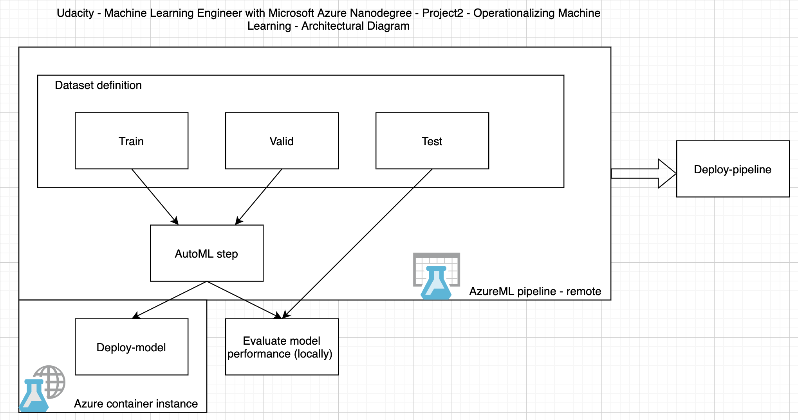

For the project execution we use a slightly modified version of the provided starter notebook. The final version with 
the solution is located [here](./udacity_project2_solution.ipynb). 

During the pipeline implementation through the above notebook we reference the Azure project/workspace config as first 
step. Next we define the compute target for the execution of our pipeline.

As it can be seen on the architectural diagram, before defining the entire pipeline the datasets are made available for 
the pipeline itself. We defined 3 different datasets for different purposes: a train dataset for model training, a 
validation dataset which we also make available to the AutoML pipeline step, the latter is utilized for measuring and 
logging the actual performance of the individual experiments. The third dataset, namely the test-set is only utilized 
for "local" offline performance evaluation of the best resulting model before deploying it as an ACI. 

Next we define the pipeline with the AutoML step (config) and with the resulting outputs, and execute the experiments 
from the notebook itself on the predefined remote compute target. 

As next step we are querying the resulting metrics and downloading the best performing model artifacts which is also 
tested locally on the test-dataset.

Afterwards we deploy the model as a Azure Container Instance (ACI), and test out the endpoint functionality. Next we 
publish the entire pipeline which results in an endpoint which executes the entire AutoML pipeline. 

Last we clean up all the predefined, provisioned resources. 

## Key Steps - screenshots

1. Azure Service Principal Authentication 
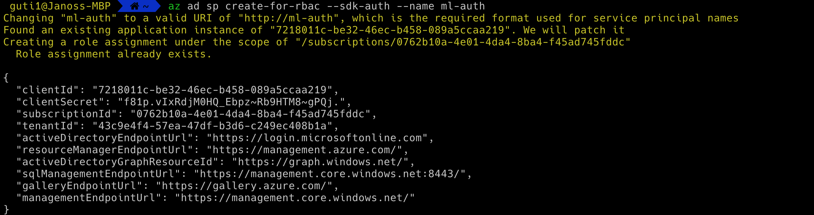

2. ML ws share executed without error
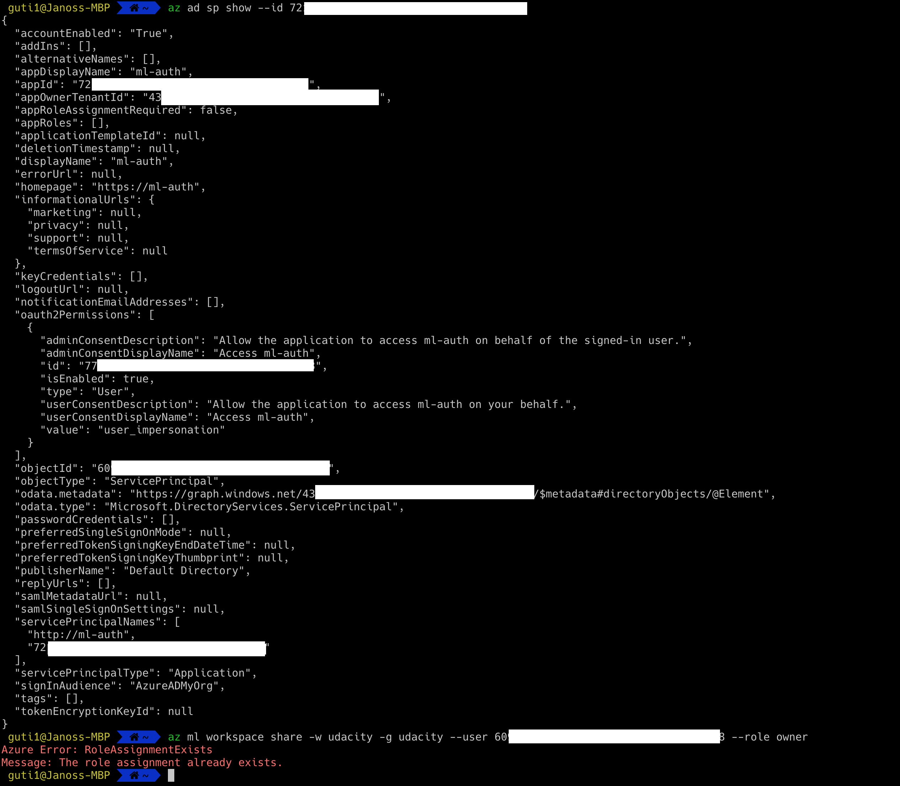

3. Registered Dataset in Ml-studio
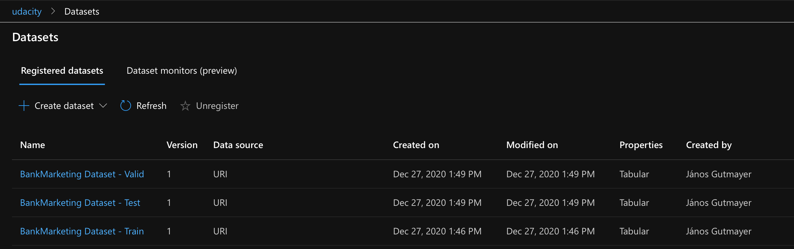
   
4. Completed experiment
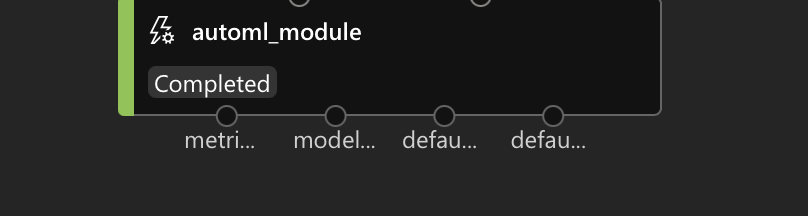
   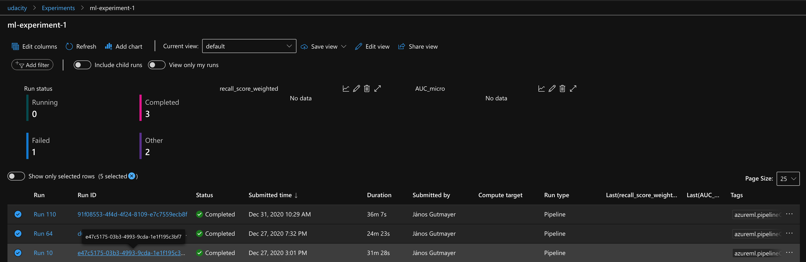
   
5. Best resulting model
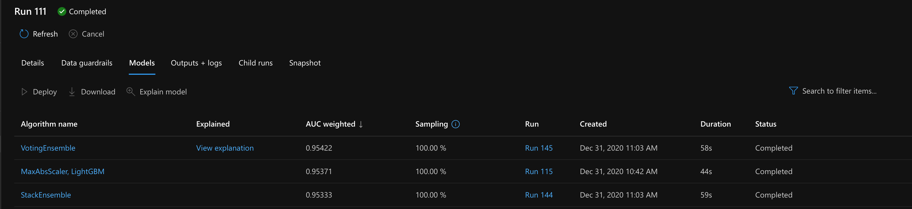
   
6. Enabled App Insights
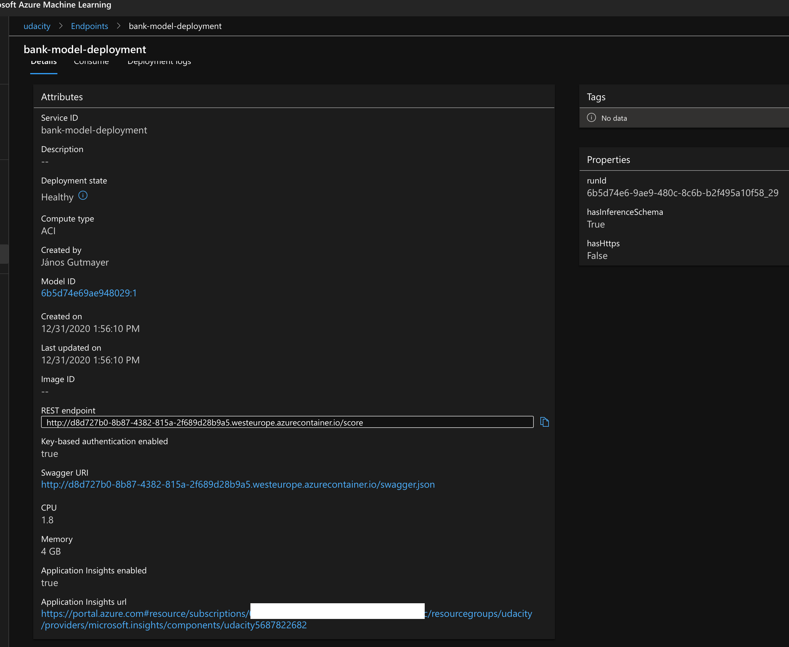
   
7. Logging (`logs.py`)
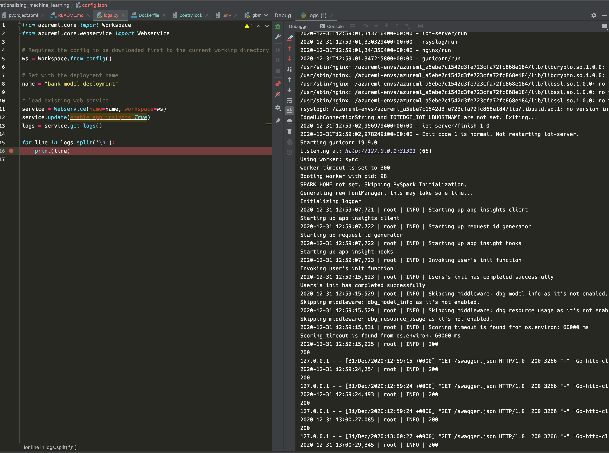
   
8. Swagger on localhost
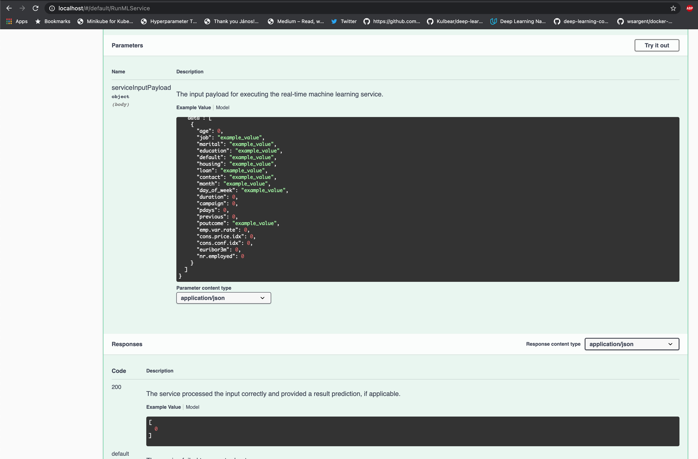
   
9. Endpoint test (`endpoint.py`)
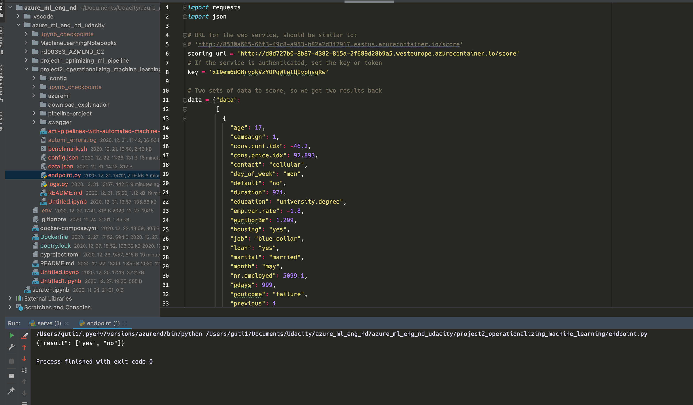
   
10. Apache Benchmark
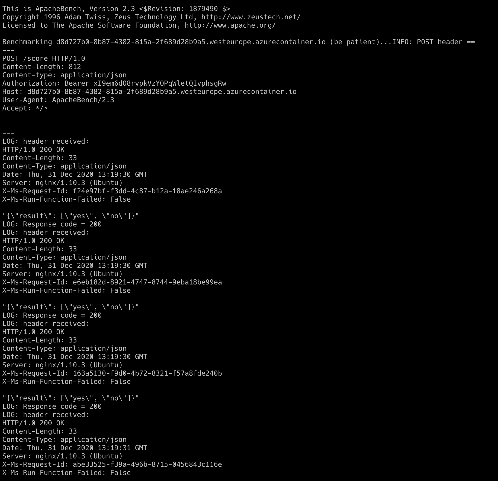
    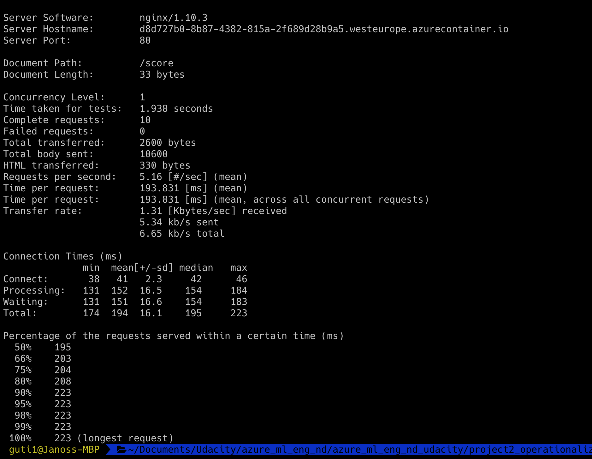
    
11. Published pipeline
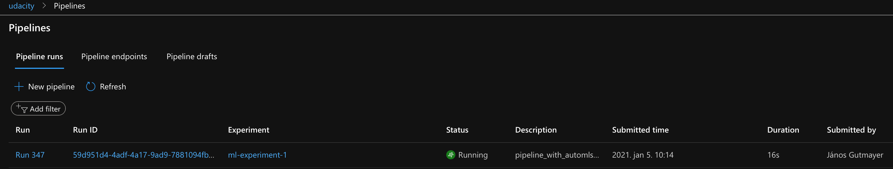
    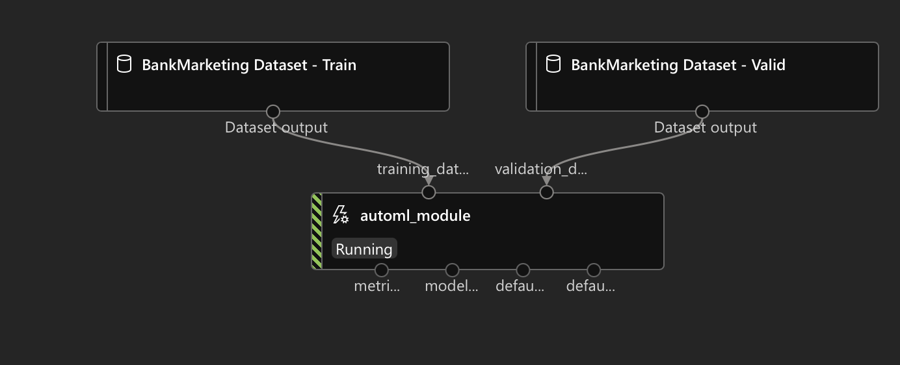
    Pipeline endpoint - online
    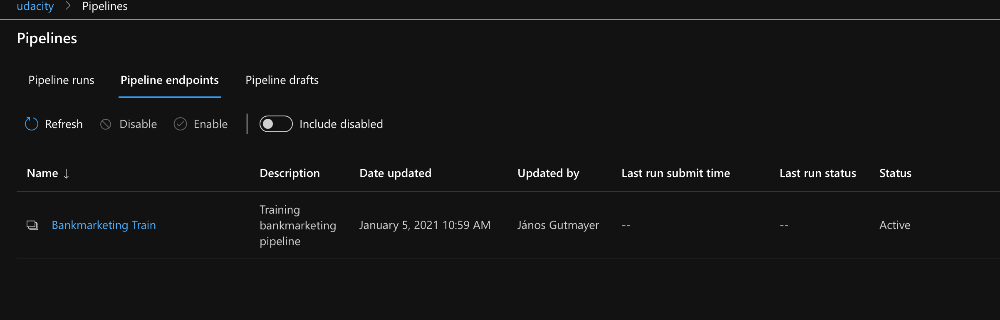
    Bankmarketing dataset
    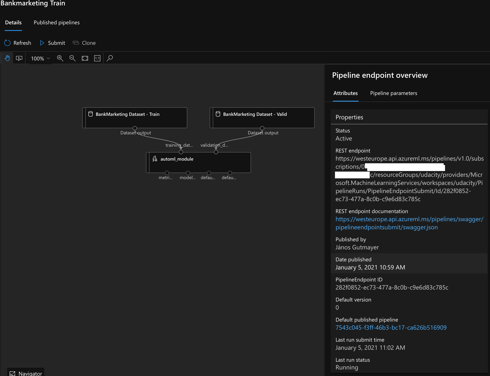
    Widget - execution
    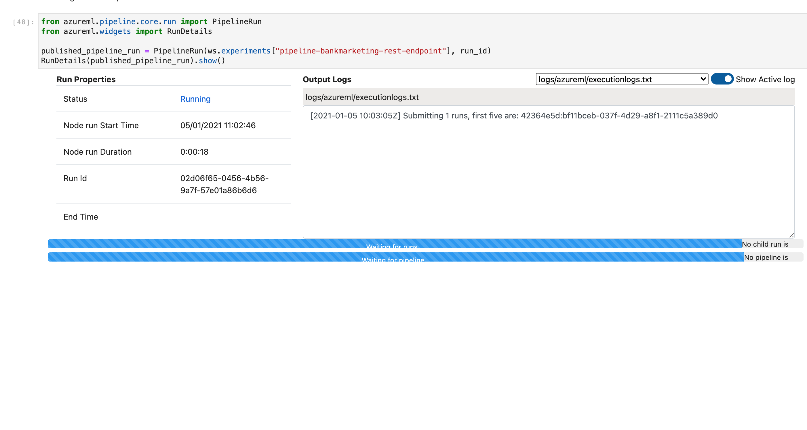
    Scheduled run
    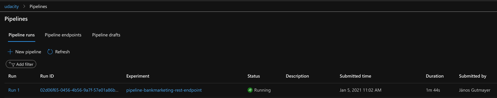

## Screen Recording

## Next steps

- [ ] Make ACI deployment part of the pipeline with gated deployment
- [ ] Integrate github with pipeline versioning - Azure Devops(?)
- [ ] Set up Github actions to trigger pipeline on code change
